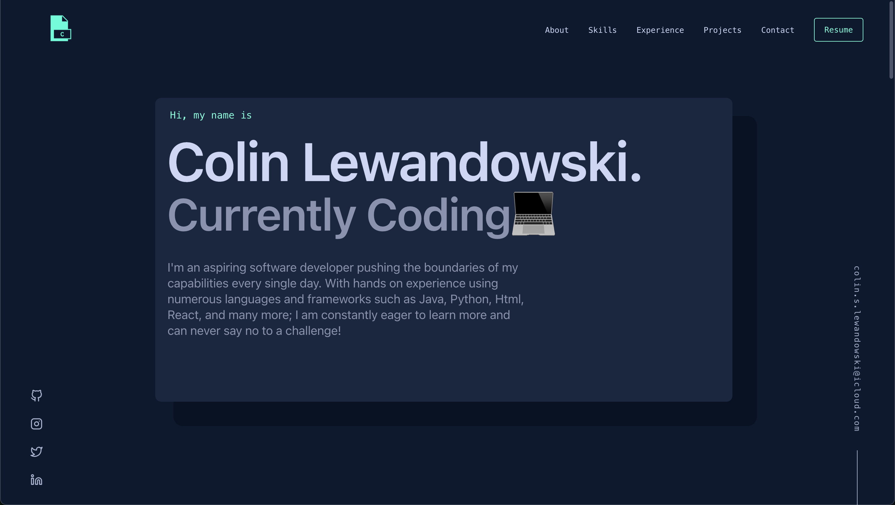

# Presonal Portfolio

A personal portfolio website showcasing my skills, experience, and projects as a software developer.



## Description

This responsive portfolio website is designed to highlight my development journey, technical skills, and project work. It features a clean, modern interface with smooth transitions and a professional aesthetic. The site is built with a focus on usability across all devices and includes interactive elements to engage visitors.

## Features

- **Responsive Design:** Fully responsive layout that adapts to various screen sizes
- **Interactive Components:** Hover effects, transitions, and animated elements
- **Mobile Navigation:** Hamburger menu for smaller screens
- **Project Showcase:** Interactive project cards with detailed descriptions
- **Timeline Experience:** Visual timeline depicting my professional journey
- **Skills Display:** Visual representation of technologies I work with
- **Contact Section:** Direct email contact functionality

## Technologies Used

- HTML5
- CSS
- JavaScript
- CSS Grid and Flexbox for layouts
- Mobile-first responsive design principles

## Installation & Setup

1. Clone the repository:
   ```bash
   git clone https://github.com/CLewi1/Portfolio.git
   ```

2. Navigate to the project directory:
   ```bash
   cd Portfolio
   ```

3. Open with a local development server (like VS Code's Live Server) or simply open the `index.html` file in your browser.

## Contact

Feel free to reach out to me:
- Email: colin.s.lewandowski@icloud.com
- GitHub: [CLewi1](https://github.com/CLewi1)
- LinkedIn: [Colin Lewandowski](https://www.linkedin.com/in/colin-lewandowski-45b873301)

